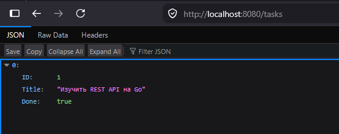

# Go Task Manager API

A simple and efficient REST API microservice for managing a task list, written in Go (Golang) without using third-party frameworks.

## Project Features
* **Thread Safety**: Data protection against concurrent access using `sync.Mutex`.
* **Clean Code**: Implemented standard, idiomatic Go logging and error handling.
* **Code Quality**: Application logic is fully covered by Unit tests (`go test`).
* **REST API**: Endpoints are implemented for creating, retrieving, and completing tasks in JSON format.

## How to Run
1. Run tests: `go test -v ./task`
2. Run server: `go run main.go`

## Скриншот работы API

